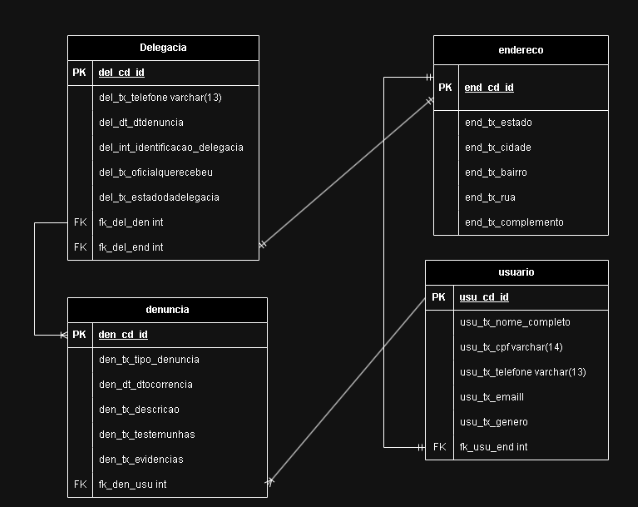

<h1 align="center">
    
</h1>

## :detective:Índice

<ul>
    <li>Sobre o Projeto</li>
    <li>Diagrama</li>
</ul>

## :desktop_computer:Sobre o Projeto

Contexto: Trabalho individual da Matéria POO.

As entidades utilizadas para fazer o trabalho foram Usuario e endereço.
As funcionalidades foram:

--->Listar nome completo dos usuarios

--->Listar os endereços dos usuarios

As duas opções fornecidas estao disponibilizadas tanto para criação do relatório impresso, tanto para a impressão no console(tela).

## :chart_with_upwards_trend: Diagramas

  ## Modelo Lógico
   

## Autores
- :boy:
Victor Lisboa - https://github.com/vintinls
